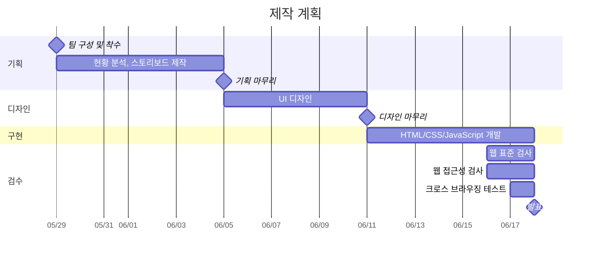

# [이스트캠프] 오르미 프론트엔드 개발 13기 2차 프로젝트

> ROUNZ 홈페이지의 UI/UX를 참조하여 홈페이지를 JavaScript를 활용하여 제작


[](https://vitejs.dev)
[](https://biomejs.dev/)
[](https://biomejs.dev)
[](./LICENSE)

## 제작 계획



## 팀원

| 이름     | 역할 | 주요 담당 | GitHub                                              | 연락                  |
| -------- | ---- | --------- | --------------------------------------------------- | --------------------- |
| 안건욱   |      |           | [agw76638](https://github.com/agw76638)             | agw76638@gmail.com    |
| 송주윤   |      |           | [Polao63](https://github.com/Polao63)               | hwangdo701@gmail.com  |
| 장진혁   |      |           | [wwg98](https://github.com/wwg98)                   | wwwg98@gmail.com      |
| 최정원   |      |           | [RaeChoe](https://github.com/RaeChoe)               | picasomati@gmail.com  |
| 최이리나 |      |           | [tsoyirina48-ai](https://github.com/tsoyirina48-ai) | tsoyirina48@gmail.com |

## 기술 스택

| 분류      | 도구                                                                 |
| --------- | -------------------------------------------------------------------- |
| 빌드      | [Vite](https://vite.dev)                                             |
| 아이콘    | [Lucide](https://lucide.dev)                                         |
| CSS 리셋  | [modern-normalize](https://github.com/sindresorhus/modern-normalize) |
| 코드 품질 | [Biome](https://biomejs.dev)                                         |

## 프로젝트 구조

```
src/
├── js/
│   ├── main.js              # 전역 CSS 진입점
│   ├── pages/
│   └── modules/
└── css/
    ├── style.css            # CSS 진입점 (import만)
    ├── base/
    │   ├── variables.css    # 디자인 토큰 (색상, 간격 등)
    │   ├── reset.css        # 전역 기본 스타일
    │   └── utilities.css    # 유틸리티 클래스
    ├── layout/
    ├── modules/
    └── pages/               # 페이지별 스타일
```

## 시작하기

```bash
git clone https://github.com/agw76638/est_fe13_2nd_project.git
npm install
npm run dev
```
