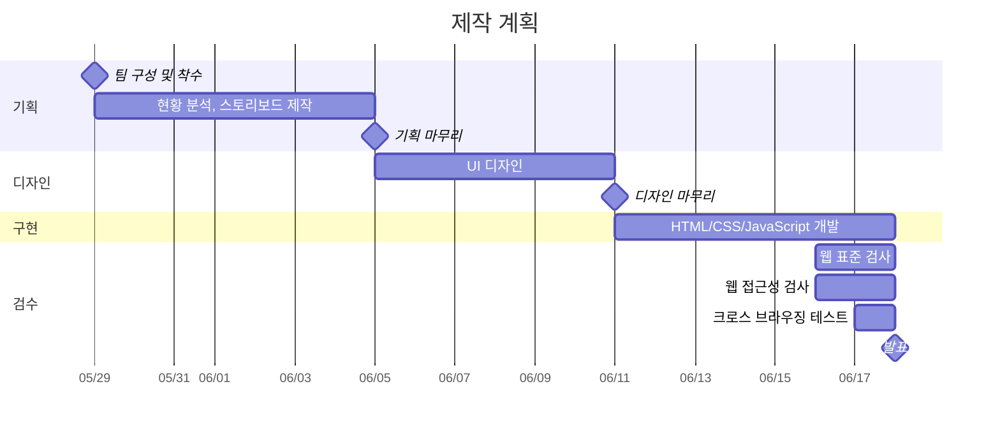

# [이스트캠프] 오르미 프론트엔드 개발 13기 2차 프로젝트

> ROUNZ 홈페이지의 UI/UX를 참조하여 홈페이지를 JavaScript를 활용하여 제작

## 제작 계획



## 시작하기

```bash
git clone https://github.com/agw76638/est_fe13_2nd_project.git
npm install
npm run dev
```
